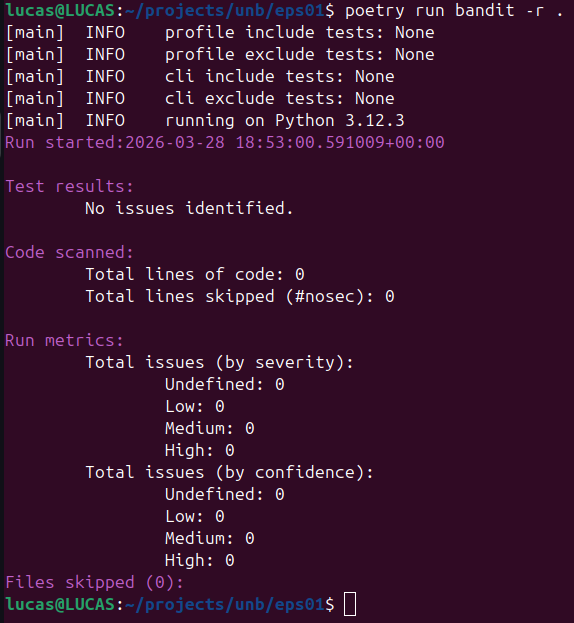
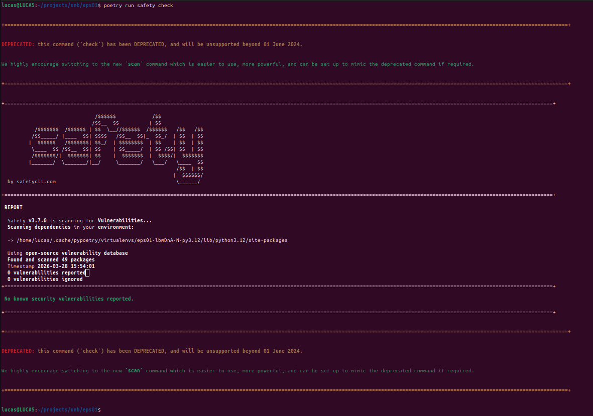
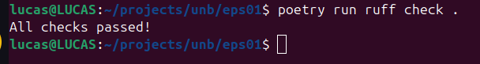
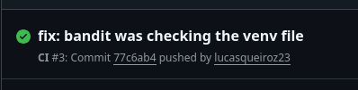

# Relatório de Prontidão Técnica: Onboarding SecOps

**Disciplina:** Engenharia de Produto de Software (FGA0316) - 2026.1
**Aluno:** Lucas Henrique Lima de Queiroz | **Matrícula:** 190091703

## 1. Configuração do Ambiente (Zero Trust & Isolamento)

Conforme as diretrizes de Soberania Técnica, as seguintes configurações foram aplicadas:

- [x] **Python 3.12:** Instalado e verificado.
- [x] **Poetry:** Configurado para criar `.venv` dentro do projeto (`virtualenvs.in-project true`).
- [x] **Determinismo:** Arquivos `pyproject.toml` e `poetry.lock` gerados com sucesso.

## 2. Logs de Auditoria e Qualidade (Security Gate)

Abaixo constam os resumos das execuções dos comandos de segurança:

### 2.1. Auditoria Estática (Bandit)

> [Cole aqui o log resumido ou o número de vulnerabilidades encontradas - Deve ser ZERO]

```
[main]  INFO    profile include tests: None                                                                                                                                             
[main]  INFO    profile exclude tests: None                                                                                                                                             
[main]  INFO    cli include tests: None                                                                                                                                                 
[main]  INFO    cli exclude tests: None                                                                                                                                                 
[main]  INFO    running on Python 3.12.3                                                                                                                                                
Run started:2026-03-28 19:01:21.970540+00:00                                                                                                                                            

Test results:
        No issues identified.

Code scanned:
        Total lines of code: 0
        Total lines skipped (#nosec): 0

Run metrics:
        Total issues (by severity):
                Undefined: 0
                Low: 0
                Medium: 0
                High: 0
        Total issues (by confidence):
                Undefined: 0
                Low: 0
                Medium: 0
                High: 0
Files skipped (0):
```

*Comando: `poetry run bandit -r .`*



### 2.2. Verificação de Dependências (Safety)

```
+=======================================================================================================================================================================================
====+


DEPRECATED: this command (`check`) has been DEPRECATED, and will be unsupported beyond 01 June 2024.


We highly encourage switching to the new `scan` command which is easier to use, more powerful, and can be set up to mimic the deprecated command if required.


+=======================================================================================================================================================================================
====+

+======================================================================================================================================================================================+

                               /$$$$$$            /$$
                              /$$__  $$          | $$
           /$$$$$$$  /$$$$$$ | $$  \__//$$$$$$  /$$$$$$   /$$   /$$
          /$$_____/ |____  $$| $$$$   /$$__  $$|_  $$_/  | $$  | $$
         |  $$$$$$   /$$$$$$$| $$_/  | $$$$$$$$  | $$    | $$  | $$
          \____  $$ /$$__  $$| $$    | $$_____/  | $$ /$$| $$  | $$
          /$$$$$$$/|  $$$$$$$| $$    |  $$$$$$$  |  $$$$/|  $$$$$$$
         |_______/  \_______/|__/     \_______/   \___/   \____  $$
                                                          /$$  | $$
                                                         |  $$$$$$/
  by safetycli.com                                        \______/

+======================================================================================================================================================================================$
 REPORT 

  Safety v3.7.0 is scanning for Vulnerabilities...
  Scanning dependencies in your environment:

  -> /home/lucas/.cache/pypoetry/virtualenvs/eps01-lbmDnA-N-py3.12/lib/python3.12/site-packages

  Using open-source vulnerability database
  Found and scanned 49 packages
  Timestamp 2026-03-28 16:02:11
  0 vulnerabilities reported
  0 vulnerabilities ignored

+======================================================================================================================================================================================+

 No known security vulnerabilities reported. 

+======================================================================================================================================================================================+


+======================================================================================================================================================================================$
DEPRECATED: this command (`check`) has been DEPRECATED, and will be unsupported beyond 01 June 2024.


We highly encourage switching to the new `scan` command which is easier to use, more powerful, and can be set up to mimic the deprecated command if required.


+===========================================================================================================================================================================================+
```

*Comando: `poetry run safety check`*



### 2.3. Qualidade e Conformidade (Ruff)

```
All checks passed!
```

*Comando: `poetry run ruff check .`*



## 3. Evidência de Integração Contínua (CI)

O pipeline automatizado foi executado com sucesso no GitHub Actions:

- **Link da Action de Sucesso:** [https://github.com/lucasqueiroz23/eps-01/actions/runs/23691447221](https://github.com/lucasqueiroz23/eps-01/actions/runs/23691447221)



## 4. Declaração de Soberania Técnica (CISSP Domain 8)

Eu, Lucas Henrique Lima de Queiroz, declaro que auditei manualmente as ferramentas e dependências deste projeto. Confirmo que o código gerado via IA (GitHub Copilot) passou pela minha revisão humana (*Human-in-the-loop*), garantindo que não há vazamento de segredos ou falhas lógicas críticas antes da migração para o ecossistema da PCDF.

---

**Data de Entrega:** 30/03/2026

## Observações

Eu escolhi executar os checks de CI no mesmo job, ao invés de jobs paralelos, para evitar a latência de instanciar runners novos e instalar as dependências mais de uma vez. Além disso, na etapa de execução do `bandit`, tive que adicionar a opção `-x ./.venv` ao CI para evitar que ele verificasse os arquivos da `venv`, ou seja, validasse apenas os arquivos do projeto, e não as dependências.
